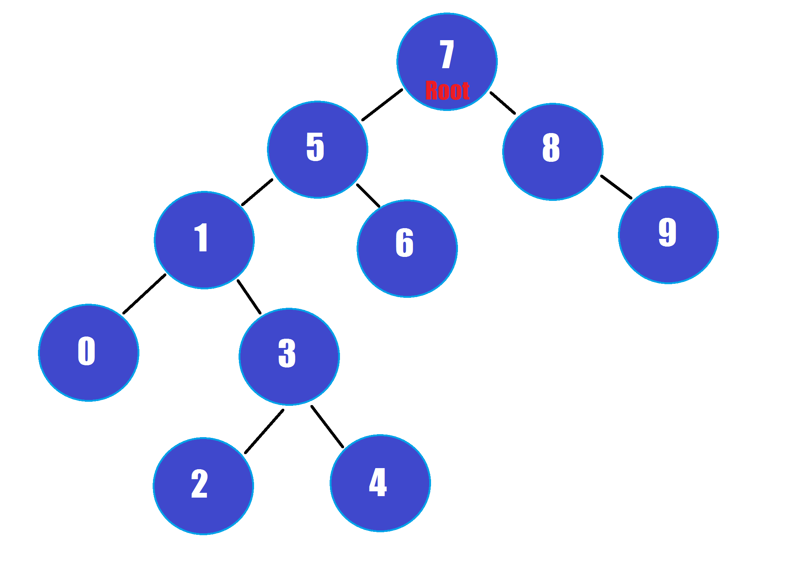

# binarySearchTreeProject
[Kodluyoruz](www.patika.dev) .Net patikası için oluşturduğum Binary Search Tree Projesi
## Proje 3
### [7, 5, 1, 8, 3, 6, 0, 9, 4, 2] dizisinin Binary-Search-Tree aşamalarını yazınız.
- 7'yi root olarak seçeriz;
- 7'nin solunda 5, sağında 8 bulunur;
- 5'in solunda 1, sağında 6 bulunur;
- 1'in solunda 0, sağında 3 bulunur;
- 3'ün solunda 2, sağında 4 bulunur.
- Proje Görseli
 
#### www.patika.dev
